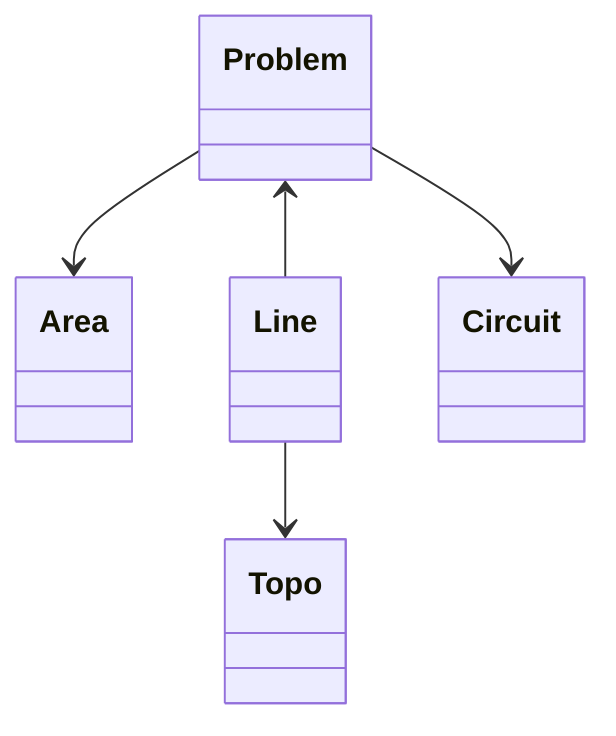

# Boolder Data

[Boolder](https://www.boolder.com) is the best way to discover bouldering in Fontainebleau.

Here is the data used by the [Android](https://github.com/boolder-org/boolder-android) and [iPhone](https://github.com/boolder-org/boolder-ios) apps. Feel free to use it as you want!

[More about Boolder](https://www.boolder.com/en/about)

## License

  

This work is licensed under a [Creative Commons Attribution 4.0 International License](http://creativecommons.org/licenses/by/4.0/).

## Database

The `boolder.db` file is an [SQLite](https://en.wikipedia.org/wiki/SQLite) database with the following structure:

### Problem

A problem is a specific way to climb a boulder.

| Column          | Type      | Example             | Description   |
| --------------- | --------- | -------------       | ------------- |
| id              | `INTEGER` | 506                 | Unique id    |
| name            | `TEXT`    | La Marie-Rose       | Name of the problem |
| name_en         | `TEXT`    | La Marie-Rose       | Same as name, but falls back to placeholders in English if problem has no name |
| name_searchable | `TEXT`    | lamarierose         | Same as name, but with only lowercase accent-free alphanumeric characters (for search purposes) |
| grade           | `TEXT`    | 6a                  | [Fontainebleau-style grade](https://en.wikipedia.org/wiki/Grade_(bouldering)#Fontainebleau_grades) from 1a to 9c+ |
| latitude        | `REAL`    | 48.44706625262      | GPS latitude |
| longitude       | `REAL`    | 2.63909882977       | GPS longitude |
| circuit_id      | `INTEGER` | 15                  | Used to join on circuits table |
| circuit_number  | `TEXT`    | 22                  | Number within the circuit |
| circuit_color   | `TEXT`    | red                 | Possible values: yellow purple orange green blue skyblue salmon red black white |
| steepness       | `TEXT`    | wall                | Possible values: wall slab overhang roof traverse other |
| sit_start       | `INTEGER` | 1                   | `1` for sit start, `0` for normal start  |
| area_id         | `INTEGER` | 4                   | Used to join on areas table |
| bleau_info_id   | `INTEGER` | 2128                | Id on bleau.info |
| featured        | `INTEGER` | 1                   | `1` if problem is "popular", `0` otherwise |
| popularity      | `INTEGER` | 14923               | The higher the more popular |
| parent_id       | `INTEGER` | 1234                | Id of the parent problem (if it exists) |

### Topo

A topo is a photo of a problem, identified by a unique id (`topo_id`).

The actual photos are stored in the `topos` folder, with a resolution of 800x600.

Note: higher resolutions photos will be available in the future.

### Line

A line is a set of (x,y) coordinates drawn on top of a topo photo to show the (rough) path to climb a given problem.

| Column            | Type      | Example                                                                                   | Description   |
| ---------------   | --------- | -------------                                                                             | ------------- |
| id                | `INTEGER` | 123                                                                                       | Unique id  |
| problem_id        | `INTEGER` | 456                                                                                       | Id of the problem  |
| topo_id           | `INTEGER` | 789                                                                                       | Id of the topo photo  |
| coordinates       | `TEXT`    | [{"x"=>0.1425, "y"=>0.4483}, {"x"=>0.3025, "y"=>0.4617}, {"x"=>0.4612, "y"=>0.4633}]      | Json array of the (x,y) coordinates (in fraction of width/height), representing a line to be drawn on the topo photo  |

### Area

An area is a geographic zone with problems.

| Column          | Type      | Example                                                   | Description   |
| --------------- | --------- | -------------                                             | ------------- |
| id              | `INTEGER` | 4                                                         | Unique id  |
| name            | `TEXT`    | Cuvier                                                    | Name of the area |
| name_searchable | `TEXT`    | cuvier                                                    | Same as name, but with only lowercase accent-free alphanumeric characters (for search purposes) |
| priority        | `INTEGER` | 1                                                         | Goes from 1 to 3. Useful to show popular areas higher in the search results                           |
| description_fr  | `TEXT`    | Cuvier est un secteur mythique ...                        | Description in French                           |
| description_en  | `TEXT`    | Cuvier is one of the most famous areas ...                | Description in English                           |
| warning_fr      | `TEXT`    | La peinture du circuit orange est presque effacée ...     | Warning in French                           |
| warning_en      | `TEXT`    | The orange circuit's paint is almost faded ...            | Warning in English                           |
| tags            | `TEXT`    | popular,beginner_friendly                                 | Tags separated by a comma. Possible values: popular beginner_friendly family_friendly dry_fast |
| south_west_lat  | `REAL`    | 48.4464022004                                             | GPS bounds (south west latitude)                           |
| south_west_lon  | `REAL`    | 2.63738594916                                             | GPS bounds (south west longitude)                           |
| north_east_lat  | `REAL`    | 48.4479009016                                             | GPS bounds (north east latitude)                           |
| north_east_lon  | `REAL`    | 2.63972684674                                             | GPS bounds (north east longitude)                           |
| level1_count    | `INTEGER` | 4                                                         | Number of level 1 problems                           |
| level2_count    | `INTEGER` | 25                                                        | Number of level 2 problems                           |
| level3_count    | `INTEGER` | 48                                                        | Number of level 3 problems                           |
| level4_count    | `INTEGER` | 50                                                        | Number of level 4 problems                           |
| level5_count    | `INTEGER` | 129                                                       | Number of level 5 problems                           |
| level6_count    | `INTEGER` | 146                                                       | Number of level 6 problems                           |
| level7_count    | `INTEGER` | 120                                                       | Number of level 7 problems                           |
| level8_count    | `INTEGER` | 9                                                         | Number of level 8 problems                           |
| problems_count  | `INTEGER` | 531                                                       | Number of problems                           |

### Circuit

A circuit is a collection of problems that are meant to be climbed in a given order.

| Column            | Type      | Example             | Description   |
| ---------------   | --------- | -------------       | ------------- |
| id                | `INTEGER` | 23                  | Unique id  |
| color             | `TEXT`    | blue                | Possible values: yellow purple orange green blue skyblue salmon red black white  |
| average_grade     | `TEXT`    | 4a                  | Average grade of the circuit's problems   |
| beginner_friendly | `INTEGER` | 0                   | `1` if it's beginner friendly (many easy/low boulders), `0` otherwise  |
| dangerous         | `INTEGER` | 0                   | `1` if it's dangerous (many high/exposed boulders), `0` otherwise |
| south_west_lat    | `REAL`    | 48.46116370582      | GPS bounds (south west latitude)    |
| south_west_lon    | `REAL`    | 2.66248113233       | GPS bounds (south west longitude)   |
| north_east_lat    | `REAL`    | 48.46329620704      | GPS bounds (north east latitude)    |
| north_east_lon    | `REAL`    | 2.66375597577       | GPS bounds (north east longitude)   |

## Geojson files

In addition to the database, you will find several [GeoJson]([url](https://en.wikipedia.org/wiki/GeoJSON)) files in the `geojson` folder:
- `problems.geojson`
- `areas.geojson`
- `circuits.geojson`

These files contain only the geographic information plus a few basic fields. You need the database to get the rest.

Recommended tool to view/edit geojson files: [JOSM](https://josm.openstreetmap.de)

## Get in touch

If you have any question, we'd be happy to hear from you!

Drop us a line at hello@boolder.com
